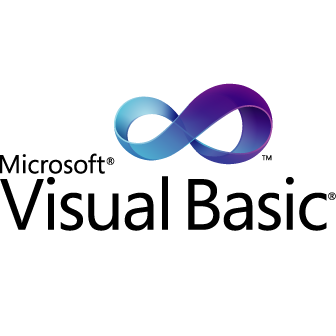

<!-- 
    // Attributions: 

    <a href="https://www.flaticon.com/free-icons/hello" alt="hello icons">Hello icons created by Freepik - Flaticon</a>
    <a href="https://www.flaticon.com/free-icons/whatsapp" alt="whatsapp icons">Whatsapp icons created by Ruslan Babkin - Flaticon</a>
    <a href="https://www.flaticon.com/free-icons/portal" alt="portal icons">Portal icons created by Pixel perfect - Flaticon</a>
    <a href="https://www.flaticon.com/free-icons/c-sharp" alt="c sharp icons">C sharp icons created by Freepik - Flaticon</a>
    <a href="https://www.flaticon.com/free-icons/c-" alt="c++ icons">C++ icons created by Freepik - Flaticon</a>
    <a href="https://www.flaticon.com/free-icons/html" alt="html icons">Html icons created by Pixel perfect - Flaticon</a>
    <a href="https://www.flaticon.com/free-icons/css-3" alt="css 3 icons">Css 3 icons created by Freepik - Flaticon</a>
    <a href="https://www.flaticon.com/free-icons/js" alt="js icons">Js icons created by Freepik - Flaticon</a>
    <a href="https://www.flaticon.com/free-icons/php" alt="php icons">Php icons created by Freepik - Flaticon</a>
    <a href="https://www.flaticon.com/free-icons/mysql" alt="mysql icons">Mysql icons created by Pixel perfect - Flaticon</a> 
    <a href="https://www.flaticon.com/free-icons/java" title="java icons">Java icons created by Freepik - Flaticon</a>
-->

<h1 align = "center">
<h1 align = "center">Hello, world!</h1>
<h1 align = "center">I'm Shaiyur Dooken, an aspiring developer from 🇿🇦</h1>

<h2>🙋🏽‍♂️ About me</h2>
<ul>
    <li>📖 I'm in the final year of my studies towards a <b>BSc IT</b>.</li>
    <li>✔️ I'm currently brushing up on: <b>Data Structures</b>.</li>
    <li>📧 <a href = "mailto: shaiyur101@gmail.com">Reach</a> out to me via e-mail.</li>
    <li>🔥 <b>Fun Fact:</b> I'm a SEGA fanboy, having owned a console when I was younger.</li>
</ul>

---

<h2 style = "color: #f00;">🖥️ Languages</h2>
<ul>
    <li></li>
    <li></li>
    <li></li>
    <li></li>
    <li></li>
    <li></li>
    <li></li>
    <li></li>
    <li></li>

---

<h2>🧮 Other Academic Modules</h2>

    Apart from learning the above languages, I've also covered the 
    following modules: 

<ul>
    <li>Artificial Intelligence 700</li>
    <li>Big Data and IoT 600</li>
    <li>Cloud Computing 600</li>
    <li>Cyber Security 700</li>
    <li>Database Systems 600</li>
    <li>Information Systems 622</li>
    <li>Machine Learning 600</li>
    <li>IT Project Management 700</li>
</ul>
